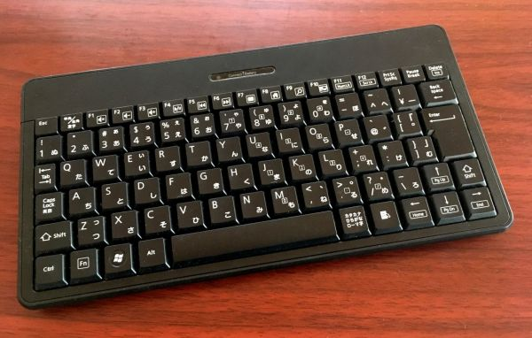
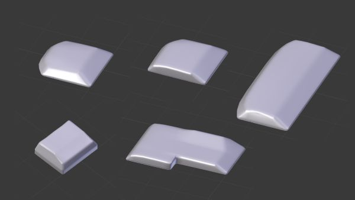

# 作ってみたい、作らなくてもいい、夢のキーボードを描いてみた

## はじめに

これは[キーボード Advent Calendar 2021](https://adventar.org/calendars/6496)１２日目の記事です。

はじめまして。[柏崎ワロタロ](https://twitter.com/warotarock)と申します。
キーボードのアドベントカレンダー初参加です。

自称プログラマーです。

キーボードはちょっとした改造はしてますが、自作は未経験です。今回も自作はしないで、イメージだけ描いてみました。

# ケイフ・オブ・マイキーボード

まずはマイキーボードの系譜をご紹介します。

傾向としてはノートパソコン系のレイアウト、浅キーストローク、狭キーピッチです。

## DynaBook DB65P/4MC
究極のスタートは中学生のときに学校で触ったPC-9801時代のフルキーボードなんですが、次が高校生のときに親に買ってもらった最初で最後ののノートパソコンがDynaBookでした。

キーボード、たぶんですが沖電気製です。これは押し心地がソフトで指に優しくて好きでした。

パンタグラフ式、キーピッチは19mm、キーストロークは2mmくらいです。

相当長い間、８年くらいは使っていたので、これが自分の基本になっていると思います。

（相当古いうえに保存状態がアレで画面なんか溶けちゃってます）

## iBUFFALO SRKB02

980円くらいの安いフルキーボードを使っていた時期もあったですがしっくりせず、そのうちに購入したのがこれでした。パンタグラフ式で、キーピッチ16mm弱、キーストローク1mm～1.5mmくらいだと思います。単四電池２個使用の無線です。超薄いです。

これのいいところは、幅25cmくらいの小さいサイズに日本語配列の欲しいキーが全部入っているところです。

一方で、どこのサイトのレビューを見ても打ち間違いしやすいと書いてありますね。自分もそう感じましたが、思えばそれがきっかけで改造に手を出したんだったりします。

なお、正面からの写真しか残ってないのは改造してしまったからです。

## ELECOM TK-GMFCM006

電気屋で980円で売っていたので買ってみたものです。写真は後にAmazonで購入したBluetooth版です。

上で紹介したSRKB02をさらに小さくしたような感じです。メンブレン式で、公式サイトによるとキーピッチ15.4mm、キーストローク2.5mmとのことです。

これのいいところは、キーピッチが狭いことです。もちろん、人によっては合わないと思いますが。

ちなみに、ラバードームとキーキャップの間に詰め物をして、キーストロークを1mmかそのくらいまで浅くしています。

## Epomaker SK66

メカニカルのキーボードも買ってみました。

これは打鍵感もいいし、七色に光ったりもします。

カスタマイズ性もすばらしくて、専用のツールでほとんどなんでも設定できます。
Temp Layerというのを使うと実質Fnキーを増やしたりもできます。

しかし、筆者はプログラマーなので、やはりF1～F12のキーが欲しいなぁと、どうしても感じます。Excelとかも手がF2を憶えてしまっていますし。

ファンクションキーだけのメカニカルキーボードが欲しい。そうしたらこのキーボードをもっと活用できる。欲を言えば、F1～F6までとF7～F12までが分割されているものが欲しい。その理由は、下のほうまで読んでただくと、なんとなくお分かりいただけると思います。

# 改造・オブ・マイキーボード

改造といっても大したことはしてないんですが…。

## iBUFFALO SRKB02のキートップを自作してみた

二年くらい前のある日、SRKB02の打ち間違いが多い原因はキートップが完全に平面だからなんじゃないか、と思いました。

解決方法を数か月考えた後（悩みすぎ）、思い立ってキートップを自作してみました。

最初にご紹介したDynaBookの「無変換」キーをもいできて、100円ショップの軽量粘土で型をとり、16mm×16mmにサイズを調整し、水性ウレタンニスを塗って型にしてキートップを量産しました。

キートップの素材も同じ粘土とニスです。文字は手書きです。

このキートップにしたら劇的に打ちやすくなりました。打ち間違いにくくなっただけでなく、触感が良くなったからか打っていて気持ちいいです。艶消しの水性ウレタンニスはすべすべした触感になります。

Enterキーが少しでっぱっているのもちょっとしたこだわり。

キートップは両面テープで張り付けています。
それでも薄いので持ち出すのに便利です。
背景のせいで見づらくてすみません。なんでモモなんか選んだのか。

このキーボードは現在もタブレット端末を使うときに使用しています。

## ELECOM TK-GMFCM006のキートップも自作してみた１

こっちもやってみました。

SRKB02のときより掘りを深くしてあります。
良くなった気もするし、あまり変わらない気もします。

## ELECOM TK-GMFCM006のキートップも自作してみた２

「指ってキーボードに斜めに入ってるよなぁ」と思い、キートップを斜めにしてみました。

見た目の違和感のわりに、使用感はあまり変わらないです(笑)。

素材は100円ショップの木粉粘土です。これまでと違いもととなる型が無いので、自分で造形しました。木粉粘土は乾いた後でも水分を与えれば足したり削ったりかなり自由にできるので便利ですね。

あと、油性ウレタンニスを塗ったので凄いテカテカしてます。

右下の黄色いところはSRKB02とほぼ同じものです。思いつきで黄色い粘土で作ってみました。

## デュアルキーボード

お気づきになられた人もいると思いますが、上の二つは二つ同時に使うためなので半分しか作っていません。

下の写真のように並べて使っています。間にマウスが入ることもあります。

かれこれ５、６年はこの使い方をしています。昔はキーボードを自作するという発想がそもそも無かったんですね。やりたいことは左右分割キーボードと一緒です。

分割キーボードと比べての利点はあまり無いんですけど、左手でもCtrl+Yとかができることとかでしょうか。古いエディタを使うときとか、お絵かきとか、3DCGソフトのときなんかには左手だけでショートカットキーがフルに使えるのは重宝するときもあります。キーボード自体が小さいのでCtrl+Jくらいまではできます。

たまたまですが、この文章を書いているとき、右手で十字キーを打ちながら左手で [ を打っている自分に気付いたりもしました。

欠点はFnキーが連動しないこと。これは本当に惜しい。

# ドリーム・オブ・マイキーボード

筆者もいつかはキーボードを自作してみたいのですが、電子回路の知識はゼロのうえに、素人のくせに理想が高すぎるというか、今より良くないとつかわないし、使わないもの作ってもしかたないなぁみたいなことから、なかなか踏み出せません。

でも夢を描くなら、夢のキーボードは、たぶんきっと、次のようなものです。

- SRKB02またはTK-GMFCM006のキーレイアウト
- キーピッチ：16mm
- キーストローク：1.5mm
- メカニカル
- 静音
- 薄型、コンパクト
- Fnキーで十字キーがHome、End、PageUp、PageDownになる
- FnキーでJのあたりがテンキーになる
- Fnキーが二枚のキーボードの間で連動する
- 有線、Bluetooth対応

うーん自分が自作するのは無理だ(笑)。メカニカル意外の条件は今使っているキーボードでだいたい満たしてるんですが自作するとなると難すぎる。というか二枚が連動って二枚作るんかい！

ということで（どういうことだ）、筆者に今できることとして3DCGで作ってみました。Blender/Cyclesです。

（文字が飛び出てるのは技術力の無さによるもの）

今までの経験をふまえて、キートップは下のような感じです。

手前側に斜面があるのが一番の特徴でしょう。この斜面の部分が指の腹に当たるのが、個人的に気持ちいいポイントなんです。これは前述のDynaBookのキーボードの特徴を引き継いでいます。中心部分が凹んでいるのも同様です。凹みがあったほうが指の感触でキーの中心を探しやすいと思っています。

また、奥のキーを押し下げたときに手前のキーに干渉しないように、キートップの奥側を丸くして、さらに低くしています。

斜めにしないのかって？ …あれはまあ、いいかな(笑)。

他のキーも干渉しないように丸めたりしています。F1の段用（画像左下）は最上段なので丸めていません。Enterキーは右側に小指をひっかけるための山があります。

おまけで二枚にしてみました。CGなので一瞬で二枚にできます（ちょっとむなしさを感じつつ）。

# おわりに

今回はCGで理想のキーボードを描いてみました。ツヤツヤしてるのを見たら、なんか幸せな気分になりました。

あと、今回の記事を書いているとき、ふと未来の世界では身体を動かすと楽な位置にキーボードが勝手に動いてくれたら健康にいいのになーと思ったりもしました。筆者がキーボードを二枚使っているのも健康のためなんです。

ということで、キーボードアドベントカレンダー１２日目でした。
ご覧いただきありがとうございました！

（この記事は改造TK-GMFCM006二枚と[母音JK配列](https://warotarokz.sakura.ne.jp/experimental/boin-jk/)で書きました）
