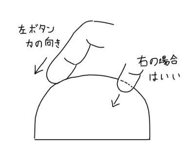
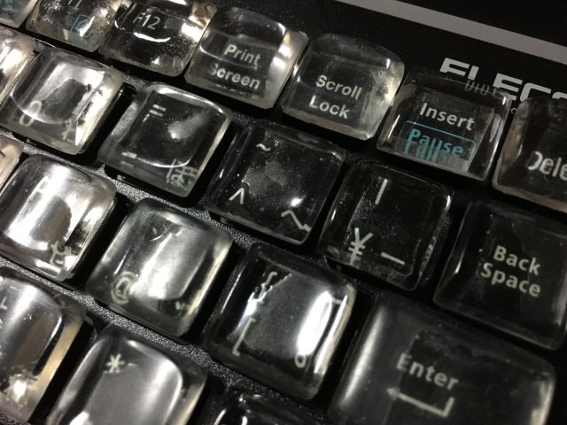

# ELECOMのキーボードのあの名機を5台持ってるPGの自キ活2022年

（このタイトルには再販しないかなーという、そこはかとない淡い期待をこめてます。名機だとは思う）

これは「[タイパー Advent Calendar 2022](https://adventar.org/calendars/7609)」１５日目の記事です。

## はじめに

[柏崎ワロタロ](https://twitter.com/warotarock)と申します。
自称プログラマーです。

[昨年](https://warotarock.github.io/advent-calendar/2021/my-dream-keyboard/)は夢の自作キーボードの妄想でCGを作ったりしました。今年は粘土でキーボードのモックを作ったり、マウスのアタッチメントを作ったり、レジンでキートップを作ったりと思いつきで色々やったのでご紹介します。

# その１、100円ショップの軽量粘土でマウスのアタッチメントを作った

## 無駄に長い月日をかけて調整しながら作った思い出

いきなり微妙にタイパーネタじゃない気もしますが(笑)

去年の夏くらいから作り始めて、使いながら自分の手に合うように調整し続けていたマウス(サンワサプライ MA-WBL36W)のアタッチメントがあります。それが今年の２月くらいに完成しました。

時間の隙間でやってたので、完成までえらい時間がかかりました。少しずつ削ったり足したり…何度も粘土を塗り重ねていると、色の違いで年輪みたいなものが出てきたりします。

最後は仕上げに白のアクリル絵具で真っ白にしてラッカーニスを塗りました。

このころは白かった。なおこの写真はステレオグラム（立体視画像）です。

そして現在。

一年弱でかなり黄色くなったり剥がれたりしてしまいました。絵具とラッカーニスの組み合わせがイマイチなのかなーと思います。今年になってＵＶレジンに手を出してみたので、そのうち白を塗りなおしてレジンでコーティングしたらどうかなと思っています。

## 独特と思われる左ボタンの形状

このアタッチメントの左クリックボタンは人差し指のために壁が作ってあります。また、指が納まる場所が三段階になっていて、その時々でどこを使ってもよいことにしています。一つの持ち方だけに最適にするのではなくていくつかの持ち方の選択肢があるほうが、疲れを分散できるんじゃないかと思っています。

自分は手首をあまりひねらないで、手の甲が斜めになる形で持ちます。すると手首は楽なんですけど、卵型とか流線形のマウスだと、人差し指は力が伝えづらいんですよね。全体が斜めになっているマウスも世の中にはけっこうありますけど、ボタン自体は重力に従って押すほうが楽なので、難しいです。それで壁を作ってみたというのが、理由というか背景です。

# その２、米粉キーボード！ 静電容量式タッチパネルでフリーレイアウトな自作キーボードが作れるか

## きっかけ

ツイッターで、導電材料を使った３Ｄプリンター製のキースイッチをタブレット端末のタッチパネルにくっつけるキットを公開（頒布？）している方を見ました。押したキーの情報をタブレットからＰＣに送っているみたいですね。

自分は電子工作ができないので、これだ！　と思って自分にも同じことができないか考えました。

## 米粉粘土

しかしプリンターは持ってないし、手で作るにしても導電材料をどうするかが問題で、悩んでいるうちに思い当たったのが、100円ショップで売っている「米粉（こめこ）粘土」です。なにか記憶にも残らないような、しょうもないものを作った余りです。

たしか原材料に「水、塩」って書いてあったはず…。

書いてある！　「こめこ、みず、えんぶん」って親しみやすい字で書いてある！

水、塩、電気といえば~~某スタンドが海で全電力を流出して敗北したことから忘れもしない~~、導電性があるはずなので、スマホの画面に当ててみたところ反応しました。これに気付いたときは嬉しくて声を出して笑いましたね…。

あとは、こんな感じに穴を開けたスポンジをスプリングの代わりにしてやればとりあえずスイッチとして機能するはずです。

## ＣＧだったキートップの実物を作る

材料が決まったので去年ＣＧで作ってみただけだったキートップを粘土で作ってみることにしました。

こんなやつです。

米粉粘土は細かい造形には向かないので、木質粘土（ウッドフォルモ）で原型を作ってみました。今思うと100円ショップの木粉粘土のほうがキメが細かいので、そっちでも良かったとかなとは思いますが。

試作品が残っているので見返してみますと、大きいのから小さいのまで色々作ったんだなーと思いますね。最終的に採用したのは一番右下のものです。（あさってな向きのまま写真撮ってしまったの今気付いた…）

白いのは原型をもとに作った型です。型は軽量粘土と水性ウレタンニスで作りました。緑のは米粉粘土を型に入れて実際に作ってみたものです。

実際作ってみると、米粉粘土が乾燥によりかなり縮んでしまい、型の段階で少し大きめに作らないと欲しい大きさにならないことが判明。大き目に作って（右から二番目）粘土を入れて乾燥させてみると、縮んでもまだ大きい…加減が難しすぎる。

また原型を作るのも面倒なので、縮んだものを心材にして二回もしくは三回、型に詰めて製造することにしました。

## 左手用を試作

実現を目指したのは下のような格子配列です。

写真が残ってないんですが、とりあえず左側だけ格子配列で作りました。しかし自分の手で触ってみると、どうも自分には感覚が合わないようなので、ロウスタッガードにしてみました。

それがこちら。

キーピッチは適当で、だいたい17mmです。日本語でよく使うＢを人差し指に近づけたかったので、Ｚの行が一般的なロウスタッガード（右にずれる形）とは違って逆のずれ方（左にずれる形）になっています。

ちなみに上の二列以外は水に強くしようと思って水性ウレタンニスが塗ってあります。

別のアングルから。

よく見るとあまりキレイではないです。もともと手作り感は強烈なんですけど、夏に高温多湿な環境に放置してしまったためにヒビが入ったり傷が浮き出てきたりしてしまいました。やはり米なので熱を与えると柔らかくなりますし、水分を与えると溶けます。ニスまで溶けて隣のキーがくっついたのは結構ショックでしたね…。

スポンジはこんな感じです。何かの透明な包装紙だったものに両面テープでスポンジを貼り付け、タブレット端末の上に乗っけてあるだけです。いちおう反応します。スポンジはドアの隙間に張り付けて隙間風をふせぐやつにポンチで穴を開けました。

しょせんスポンジなので打鍵感は気にしないとして、いちおうは押すことができる形で配列を体験できたのが良かったです。格子配列が自分に合うかどうかも試すことができました。材料費も300円くらいですし。

こういうことができるだけの安いキットがあったらいいと思いますね。米粉はダメですけど(笑)。

あとはソフトを作らないと実際に使うことはできませんが、いっそこの配列をメカニカルで実装してもいいなと思えました。やるかどうかは怪しいですけど。それと、キートップの形状がとても気に入りました。

## 余談：タッチパネルが反応する粘土について

自分が気付いたものを書いておきます。検証していませんが反応の良さはどれも大きく違わないように思います。

- [米粉粘土](https://jp.daisonet.com/products/4549131910759)
- [ウッドフォルモ](https://www.padico.co.jp/products/clay/other/other004.html)
- [樹脂粘土（酢酸ビニル）](https://jp.daisonet.com/products/4979909918135)

ウッドフォルモは木質ですが、タッチパネルが反応しました。塩は入ってないみたいです。これも水分のせいなのかなと思いトースターで加熱して水分を飛ばしてみたところ、反応しなくなりました。そのため、やはり水分が必要なのかなと思います。ちなみに、何日か経ってからタッチパネルに当ててみると、また反応するようになっていました。湿気を吸ったのかもしれません。

酢酸ビニルが材料に使われている粘土が100円ショップで売られていますが、これもタッチパネルが反応しました。材料に水が書いてあったので多少の水分が含まれているからかもしれません。完全に乾燥しているかどうかは分かりませんが、硬くなっても反応します。これのいいところは、色のバリエーションがあることですね。白と黒があるのが良いです。触り心地も良いと思います。次やるとしたらこれを使ってみたいです。

# その３、透明レジン！ キートップを自作して最高のキーボードを作れるか

## 前段：狭ピッチキーボードの名機 ELECOM TK-GMFCM006 を褒めちぎりたい

（ちなみに狭ピッチは「きょうぴっち」もしくは「せまぴっち」と読むらしい）

自分はキートップは何年か前からいじっていて、ELECOMの [TK-GMFCM006](https://www2.elecom.co.jp/game/fullkey/tk-gmfcm006/) の改造は[昨年のキーボード アドベントカレンダー](https://adventar.org/calendars/6496)で紹介しています。このキーボードが好きでして、Bluetooth版も含めて念のため5台持っています。ここではあえて盛り盛りでこの機種を紹介させていただきます。

このキーボードはメンブレン式です。そしてキーピッチが15.4mmという、かなりの狭ピッチです。ここまで狭いと、手をそれほど動かさなくとも色々なキーに指が届きます。自分は指が短いほうですが、Ctrl + Y が楽にできるのでありがたいです。また、幅24cmで全体サイズが小さいので、デュアルキーボードにも向いていると思います。

（自宅のデュアルキーボード）

それとキーのレイアウトが良いです。というか極めて普通なのですが、市販のコンパクトキーボードはだいたい、どこかのキーのサイズを犠牲にしたり、妙な位置に移動したりして全体のサイズを小さくしています。このサイズで普通の配列になっているものは、探しても、探しても、なかなか見つかりません。ここまで小さい機種がそもそも少ないですけど…。

十字キーが他のキーと同じ縦横１Ｕサイズなのもいいです。最近は十字キーの高さが半分のものが圧倒的に多いですが、プログラミング等でガシガシ十字キーを打つには縦横１Ｕが好ましいと思います。

また、Fnキーとの組み合わせでテンキーが使えます。Blenderなど一部のソフトはショートカットキーでテンキーと数字キーを区別するので、テンキーが使えるのはかなりの利点です。最近のキーボードではこの機能は少ないです。贅沢をいえば0の右に00があったら完璧。

さらに、ケーブル長が３メートルもあります。無駄に長いようでいて、デスクの右から回して左にあるＰＣに繋げるというような使い方が単体でできるので便利です。もとはプレステ３向けらしいんですが、意外とオフィスにも向いていると思います。

さらに！　足を出すと、なんと立ちます。

この機能、買ったときは「そんなんいらん(笑)」と思いましたけど、資料を広げたいときとか机の上を掃除するときとか、年に何回かは確実に使ってます。

最後に大事なところ。もう10年使ってますが、まだ壊れません。頼むから壊れないで。仕事できなくなるから（必死）

…ただ、打鍵感だけは特別良くない（というかこの世代では普通の水準）ので、詰め物を入れてキーストロークを短くしています。もともとキーストロークが短いほうが速く打てるし疲れづらいのでそうしていますが、打鍵感もあまり気にならなくなります。それにしても最近の市販のキーボードはどこのメーカーも打鍵感が良くなっていて本当にすごいなあと思います。

## キートップを自作すれば完璧！？

自作の話に戻ります。

米粉キーボードを作ったことで、自分の欲しい配列はわりと普通のロウスタッガードであることがわかりました。

そして、狭ピッチが好きなので、いまどきの狭ピッチのキーボードを買ってキートップを自分好みにすればエンドゲームなんじゃないかと思いました。

しかし、狭ピッチのキーボードを探しても好みのものが全然見つからないんです。

ロジクールの K380 とペリックスのP ERIBOARD-426 が候補だったんですけど、どちらもＺの行が微妙に右にずれているのが気になるんですよね。新機種が出て間違って左にずれないかなぁ(笑)。あと海外メーカーなので世界情勢にあわせてどんどん価格が変わるんで、優柔不断な筆者には買うタイミングが難しいです。自業自得。

それで折衷案というか、上で紹介した TK-GMFCM006 の兄弟分の [TK-DCP01BK](https://www.elecom.co.jp/products/TK-DCP01BK.html) が一瞬安くなったときがあったので、入手して改造することにしました。これはキーピッチ17.5mmです。デュアルキーボードにするのでなければこのくらいのキーピッチのほうが楽な気がします。なおパンタグラフです。

（紹介しておいて他機種でごめんなさい…それにしてもこの機種はモバイルなのかデスクトップなのか…据え置き型まるって言いきってるし据え置きかな）

## 透明レジンでキートップを作る

前の年までは粘土でキートップを作っていたのですが、100円ショップで売っていたレジンで初めて作ってみました。

（人生初のレジン工作）

透明なら文字を印字しないでいいですし、クリスタルな感じがキレイなんじゃないかと思ったわけです。

制作過程の写真があまり無いので手元に残っているモノの写真を撮りました。

写真の下のほうに並んでいるのがレジンを削って作った原型で、その上に並んでいるのが「おゆまる」、樹脂粘土（酢酸ビニル）、シリコンで作った型です。なお失敗作はこの何倍もあります。

（貴重な制作途中の写真）

## 余談：材料について

[おゆまる](https://amzn.asia/d/cAxw816)はお湯で温めると柔らかくなる樹脂粘土です。袋に原料が書いてないですけどプラスチックらしいです。基本はおゆまるで型をとって、レジンを型に流し込んでＵＶライトで固めて作ります。

ただ、レジンは固まるときに発熱し、ときどき発熱しすぎておゆまるが溶けるので、シリコン型にも挑戦しました。原型→樹脂粘土で型とり→おゆまるを詰めて原型作る→手芸用シリコンで型とり、という手順でやります。手間がかかりますけど、型としては強度が高くて扱いやすいです。でも離型剤なるものを塗ればもっと簡単にできるのかも。

ただ、やはり手間なので、おゆまる型に複数回に分けてレジンを入れて固めるほうが簡単です。

材料としては、レジンは[まさるの涙](https://amzn.asia/d/8Zujt28)が便利ですね。安いし、べたつかないです。透明感を追求するなら、磨くよりはレジンを塗ると本当に透明になります。自分はまさるの涙（サラサラタイプ）を根気よく塗ってましたが、専用のコーティング材を塗るほうが簡単で確実そうなので、そのうち試したいです。

写真の[手芸用シリコン](https://store.shopping.yahoo.co.jp/shugale1/0182548.html)はキャップをしめれば残りの保存がきくので非常に便利です。ただ透明ではないのでＵＶライトを当てるときは何度か向きを変えながら当てる必要があります。

あと、触り心地を良くするために水性ウレタンニスをうっすら塗っています。

## 完成！

マウスのときと一緒で、一度に時間がとれないですし、何度も型を作りなおしながら試行錯誤を続けて半年くらいかかりました。大きさの違うキーもけっこうありますし、スペースバーなんかはニスにムラが出まくって、コーティングしても磨いても難しくて、心が折れそうになりましたね。最終的にどうしたんだっけ？　ともかく、完成して良かった！

こちらが完成品になります。

うーん、透明。写真だと伝わるかなぁ…。なお貼り付けは「カエルテーブ」を使いました。

￥は前述のコーティングをしたので透明度があるんですが、他のキーは白っぽいです。

全部形の違うキーたち。既製品はどうしてあんなに精度が高いんだろうと思います。

ファンクションキーは少し背の高い形にしています。でも嫌われ者のF1は低いままにしました(笑)。

Enterキーは小指で押しやすいように立体的に三角にしました。

## 使ってみた感想

ストローク的な意味での打鍵感はベースのキーボードのままなので、どうしようもないんですけど、キートップの触り心地はすごく良いです。スベスベ、ツルツル。気持ちいい！

また、シリンドリカル形状なのもあって、指がキーの中央に向かって滑るように導かれ、打ち間違いが減る感じがします。キーの真ん中を押せていなくても押しやすい。素晴らしい！

自分で褒めすぎかなぁ(笑)

# おわりに

最近こんなキーボードはどうかなあと思っています。分割、左右対称、左にYまであり、変換/無変換ありなど欲しいキー全てでお絵かきとプログラミングと文字書きができる贅沢な仕様。0.75Uのキーで人差し指の移動量を減らしているのも特徴です。でも0.75Uなんてあるんですかね。まさに夢のキーボードって感じですね。

来年は、このキーボードを模したTK-GMFCM006のキートップ改造をしてみたいと計画しています。その通りまではできないまでも、近い感じにはできるかもしれないと期待しています。その結果しだいでは、ついに自作するかも。いや、どうかな(笑)

ということで、タイパーアドベントカレンダー2022 15日目（三日遅れ）でした。

ご覧いただきありがとうございました！

（この記事は透明キートップTK-DCP01BK他と[母音JK配列](https://warotarokz.sakura.ne.jp/experimental/boin-jk/)で書きました）
